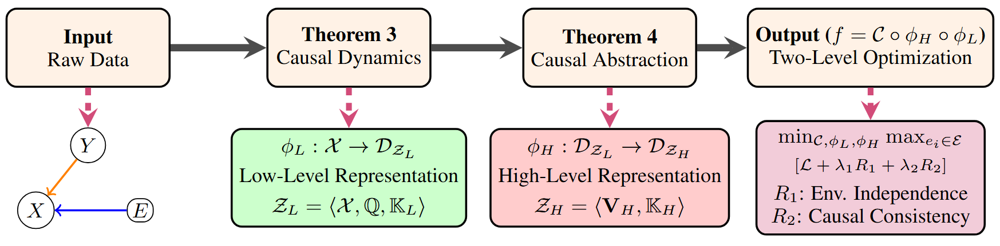

# ACIA: Anti-Causal Invariant Abstractions

[](https://opensource.org/licenses/MIT)
[](https://www.python.org/downloads/)
[](https://badge.fury.io/py/acia)

A PyTorch library for learning causally invariant representations using measure-theoretic foundations.

## Overview

ACIA implements a principled approach to causal representation learning based on:
- **Measure-theoretic causal spaces** with sigma-algebras and probability measures
- **Interventional kernels** for verifying causal structure
- **Two-stage abstraction**: Low-level (φ_L) captures all features, high-level (φ_H) extracts causal invariants
- **Regularizers** that enforce environment independence (R1) and intervention invariance (R2)

## Installation

### From PyPI (once published)
```bash
pip install acia
```

### From Source
```bash
git clone https://github.com/yourusername/acia.git
cd acia
pip install -e .
```

### Development Installation
```bash
pip install -e ".[dev]"
```

## Quick Start

### 1. ColoredMNIST Example

```python
import torch
from torch.utils.data import DataLoader
from acia import ColoredMNIST, CausalRepresentationNetwork, CausalOptimizer

# Create datasets
train_e1 = ColoredMNIST(env='e1', train=True)
train_e2 = ColoredMNIST(env='e2', train=True)
test = ColoredMNIST(env='e1', train=False)

# Combine environments
from torch.utils.data import ConcatDataset
train_data = ConcatDataset([train_e1, train_e2])
train_loader = DataLoader(train_data, batch_size=128, shuffle=True)
test_loader = DataLoader(test, batch_size=128)

# Initialize model and optimizer
model = CausalRepresentationNetwork().cuda()
optimizer = CausalOptimizer(model, batch_size=128, lr=1e-4)

# Training loop
for epoch in range(10):
    model.train()
    for x, y, e in train_loader:
        x, y, e = x.cuda(), y.cuda(), e.cuda()
        metrics = optimizer.train_step(x, y, e)
    
    # Evaluate
    model.eval()
    correct = 0
    total = 0
    with torch.no_grad():
        for x, y, e in test_loader:
            x, y, e = x.cuda(), y.cuda(), e.cuda()
            _, _, logits = model(x)
            pred = logits.argmax(dim=1)
            correct += (pred == y).sum().item()
            total += y.size(0)
    
    print(f"Epoch {epoch+1}: Accuracy = {100*correct/total:.2f}%")
```

### 2. Using Your Own Dataset

```python
import torch
from torch.utils.data import Dataset, DataLoader
from acia import CausalRepresentationNetwork, CausalOptimizer

class MyDataset(Dataset):
    """Your custom dataset must return (x, y, e) tuples.
    
    Args:
        x: Input data (images, features, etc.)
        y: Target labels
        e: Environment/domain labels (for multi-environment training)
    """
    def __init__(self, data, labels, envs):
        self.data = data
        self.labels = labels
        self.envs = envs
    
    def __len__(self):
        return len(self.data)
    
    def __getitem__(self, idx):
        return self.data[idx], self.labels[idx], self.envs[idx]

# Create your dataset
my_data = MyDataset(your_data, your_labels, your_envs)
loader = DataLoader(my_data, batch_size=64, shuffle=True)

# Use with ACIA
model = CausalRepresentationNetwork()
optimizer = CausalOptimizer(model, batch_size=64)

for x, y, e in loader:
    metrics = optimizer.train_step(x, y, e)
    print(metrics)  # {'pred_loss': ..., 'R1': ..., 'R2': ..., 'total_loss': ...}
```

## Key Components

### Datasets
- **ColoredMNIST**: Anti-causal benchmark where color depends on digit parity
- **RotatedMNIST**: Rotation varies by environment
- **Camelyon17Dataset**: Medical imaging across hospitals
- **BallAgentDataset**: Synthetic positional data with interventions

### Models
- **CausalRepresentationNetwork**: Standard two-stage architecture
- **ImprovedCausalRepresentationNetwork**: Enhanced with bottleneck and dropout
- **RMNISTModel**: Specialized for rotation invariance
- **BallCausalModel**: For continuous positional prediction
- **CamelyonModel**: ResNet-based for medical imaging

### Training
- **CausalOptimizer**: Standard optimizer with R1 and R2 regularizers
- **EnhancedCausalOptimizer**: Adds R3 (color suppression) regularizer
- **BallOptimizer**: For continuous regression tasks
- **CamelyonTrainer**: Domain adaptation for medical data

### Core Theory
- **CausalSpace**: Measure-theoretic causal spaces
- **CausalKernel**: Conditional probability kernels K(ω, A)
- **InterventionalKernel**: Computes do(X) and do(Y) interventions

## Architecture

```
Input X
   ↓
φ_L (Low-level encoder) → z_L (captures all features)
   ↓
φ_H (High-level encoder) → z_H (causally invariant)
   ↓
Classifier → predictions
```

**Loss Function:**
```
L = L_pred + λ1·R1 + λ2·R2 (+ λ3·R3)

where:
- L_pred: Standard cross-entropy
- R1: Environment independence (z_H should be similar across envs for same labels)
- R2: Intervention invariance (KL divergence between P(z_H|Y) and P(z_H|do(Y)))
- R3: Feature suppression (optional, removes spurious correlations)
```

## Examples

See the `examples/` directory for:
- `01_colored_mnist.py`: Complete ColoredMNIST training
- `02_rotated_mnist.py`: Rotation invariance
- `03_custom_dataset.py`: Using your own data
- `04_camelyon17.py`: Medical imaging domain adaptation
- `05_ball_agent.py`: Continuous regression

<p align="center">

</p>

This repository implements a novel causal representation learning framework.


## Motivations

> Identify causal invariants in anti-causal domains through direct measurement of product causal spaces

> Address covariate shift robustness through intervention-based causal abstraction

> Enable OOD generalization by learning from both perfect and imperfect interventions

> Bridge the gap between theoretical causal invariance and practical representation learning


## Contributions

> First measure-theoretic framework for anti-causal representation learning that handles both perfect and imperfect interventions without requiring explicit structural causal models

> Two-level representation learning approach decomposing into causal latent dynamics (Z_L) and causal latent abstraction (Z_H)

> Theoretical guarantees for kernel independence and optimization convergence

> State-of-the-art performance on CMNIST (97.7% accuracy) with perfect environment independence

## Method

Our approach introduces a novel measure-theoretic framework for learning in anti-causal domains (Y → X ← E). The method consists of three key algorithms:

Causal Dynamics Algorithm, Causal Abstraction Algorithm, OOD Optimization Algorithm.

<p align="center">

<br>
<em>Overview of the Method</em>
</p>

## Results

### Dataset

<p align="center">

<br>
<em>Examples from Colored MNIST datasets</em>
</p>

### Environment Independence

Our method successfully learns representations that are invariant across environments:

<p align="center">

<br>
<em>The CMNIST Results</em>
</p>

## License

This project is licensed under the MIT License - see the [LICENSE](LICENSE) file for details.

## Contributing

Contributions are welcome! Please:
1. Fork the repository
2. Create a feature branch (`git checkout -b feature/amazing-feature`)
3. Commit your changes (`git commit -m 'Add amazing feature'`)
4. Push to the branch (`git push origin feature/amazing-feature`)
5. Open a Pull Request

## Acknowledgments

Based on measure-theoretic causal representation learning principles. Special thanks to all contributors and the causal ML community.
